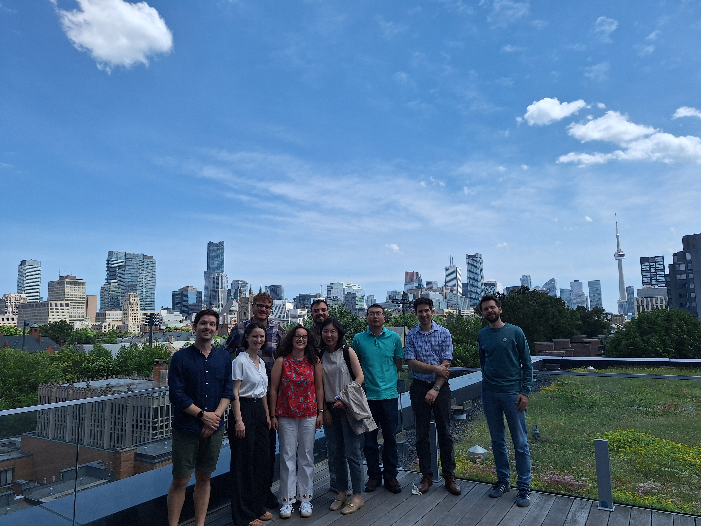
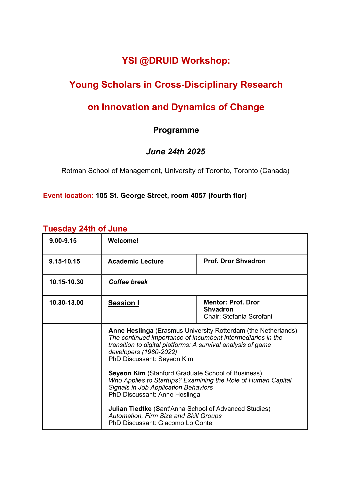
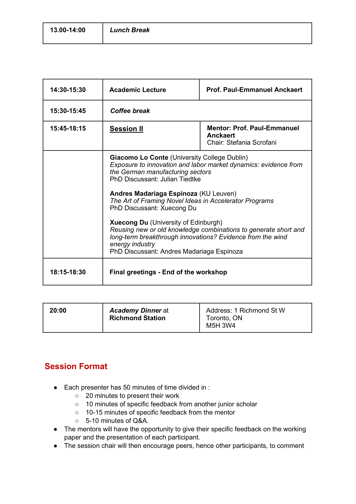
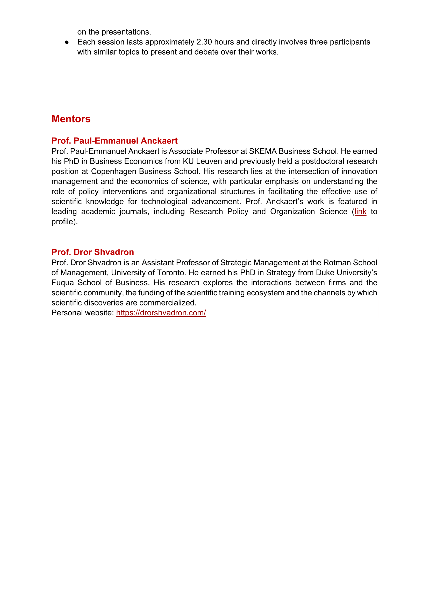

First edition of the YSI @DRUID pre-conference workshop is over!

---

On Tuesday, June 24th, we held the very first YSI @DRUID pre-conference workshop at the beautiful Rotman School of Management. Organizing the Young Scholar Initiative @ DRUID: Doctoral Workshop on Cross-Disciplinary Research on Innovation and Dynamics of Change has been both challenging and deeply rewarding—and I’m happy (and relieved!) to share that it was a success!  
A heartfelt thank you goes to Alexandra Badort, whose enthusiasm and partnership were fundamental in shaping this workshop. It truly wouldn’t have been possible without her!  
I’m also grateful to our great speakers, Prof. Paul-Emmanuel Anckaert and Prof. Dror Shvadron, for their detailed feedback on participants’ working papers and their valuable advice on navigating the job market.  
Of course, the workshop wouldn’t have been the same without our brilliant participants. Your papers were thought-provoking and well-developed, and as a fellow final-year PhD student, I genuinely enjoyed exchanging ideas and learning from each of you.  
Special thanks to Mark Lorenzen for believing in this initiative and providing continuous support throughout the organization process, to Brian Silverman for his guidance at Rotman, and to Gabriel Cavalli for his helpful tips about Toronto.  
Last but not least, thank you to the YSI network—especially the Keynesian Economics Working Group and the Economics of Innovation Working Group—for funding and making this workshop possible.  
Here you can find a beautiful picture of us from the terrace at Rotman and the program of the event!

