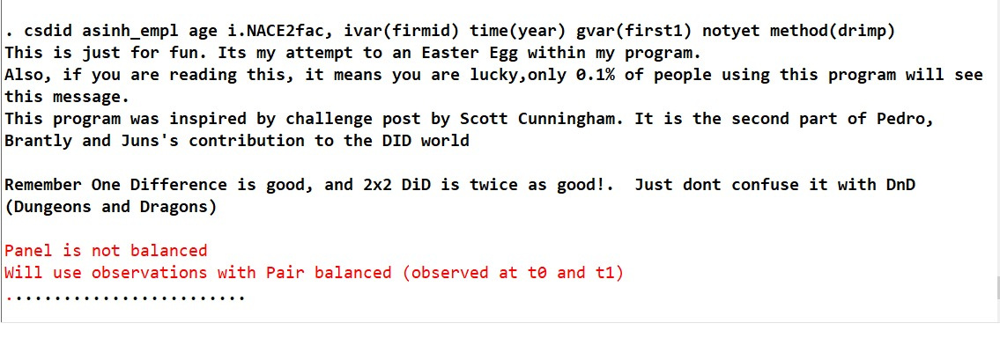

I found an Easter Egg in csdid Stata command

---

After a long working day using the Stata command csdid to perfom Difference-in-Differences with Staggered Treatment following Callaway and Sant'Anna (2020), I stumbled upon the following message. I absolutely loved the irony of the message and it definitely brightened my day!

